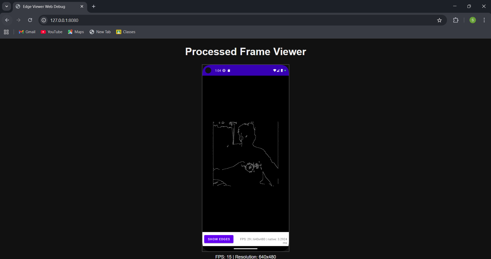
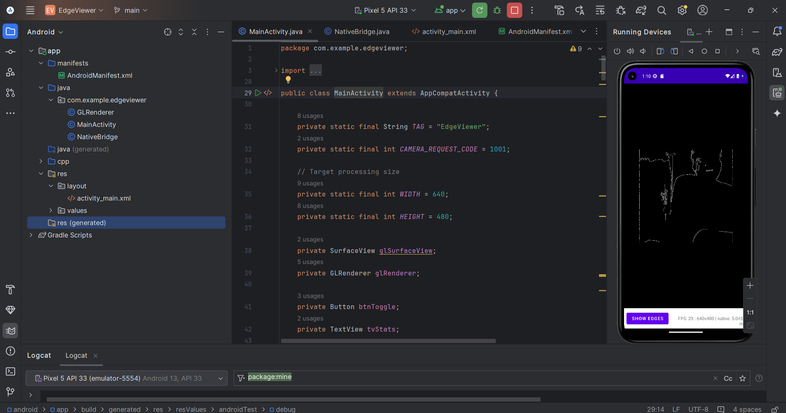

# Real-Time Edge Detection Viewer (Android + Web)

This project demonstrates a real-time camera edge detection pipeline built using:

✅ Android (Camera2 + OpenGL ES + JNI + C++)
✅ OpenCV (Canny Edge Detection)
✅ Native Frame Processing (NDK)
✅ Web Viewer (TypeScript + Static Frame Display)

It captures camera frames on Android, processes them in native C++ using OpenCV, renders them using OpenGL ES, and provides a Web UI to preview processed output.

1. Key Features Implemented
📌 Android Features

- Camera Feed Integration (Camera2 API)
- Fixed frame processing resolution: 640×480
- Native C++ frame processing using:
    - Sobel Filter (initial)
    - Canny Edge Detection (OpenCV)
- JNI bridge for sending data between Java ↔ C++
- OpenGL ES Rendering of processed frames
- Real-time performance: ~20–30 FPS
- Toggle Button: Show Raw / Show Edges
- On-screen stats: FPS, resolution, native processing time

🌐 Web Viewer Features

- Minimal TypeScript + HTML static page
- Displays a sample processed frame
- Shows basic stats (FPS, resolution)
- Clean centered UI with dark theme
- No backend required — runs with a simple local server

2. Screenshots

# ✅ Sample Processed Frame

# ✅ Web Viewer UI

# ✅ Android Live Edge Detection

3. Setup & Installation
✅ A. Requirements
Component	                                 Version
Android Studio	                   Ladybug 2024.2.1 Patch 3
NDK	                                         26.1.xx
CMake	                                     3.22.1
Target ABI	                                arm64-v8a
OpenCV Android SDK	                         4.12.0

B. Android Setup
1️⃣ Download OpenCV Android SDK

- Download & extract:
OpenCV-android-sdk

-Example path:
C:/Users/USERNAME/Downloads/OpenCV-android-sdk/

2️⃣ Update CMakeLists.txt:
set(OpenCV_DIR "C:/path/to/OpenCV-android-sdk/sdk/native/jni")
find_package(OpenCV REQUIRED)
include_directories(${OpenCV_INCLUDE_DIRS})
target_link_libraries(native-lib ${OpenCV_LIBS} log)

3️⃣ Enable NDK Build
NDK + CMake paths are auto-used by Gradle.

4️⃣ Build & Run

Connect a real ARM64 device → Run in Android Studio.
✅ You should see edges in real time.
✅ FPS stats visible at bottom.

C. Web Viewer Setup

1️⃣ Navigate to folder:
cd web-viewer

2️⃣ Install dependencies:
npm install

3️⃣ Build:
npm run build

4️⃣ Serve:
npm start

5️⃣ Open browser:
http://127.0.0.1:8080

✅ Web page shows your sample processed frame.

4. Architecture Overview
- High-Level Flow
Camera2 → YUV Frame → JNI → C++ (OpenCV) → RGBA → OpenGL → Display

* Android Architecture

* Java/Kotlin Layer
- Opens camera stream
- Converts Y-plane to grayscale buffer
- Sends to C++ via JNI
- Displays processed RGBA with OpenGL

* C++ Native Layer

- Receives grayscale frame
- Applies Canny Edge Detection
- Returns RGBA output + timing (ms)

* OpenGL Renderer

- Uploads RGBA texture
- Draws full-screen quad
- Real-time rendering

🌐 Web Architecture

- No live video stream
- Uses static processed frame
- TypeScript updates UI + stats
- Useful to demonstrate:
     - TS project setup
     - DOM manipulation
     - Basic visualization workflow